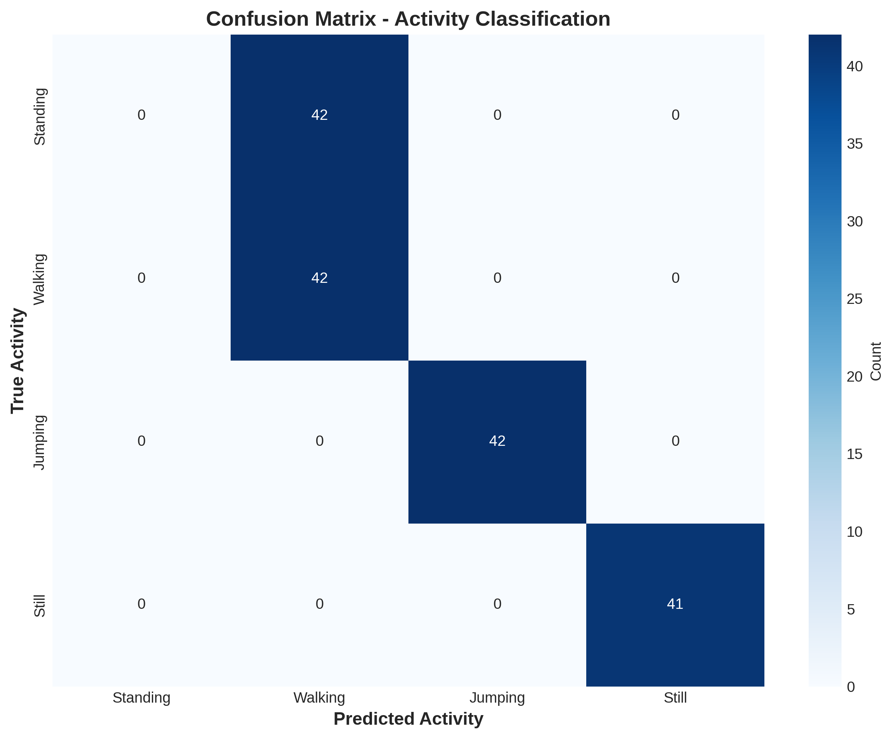
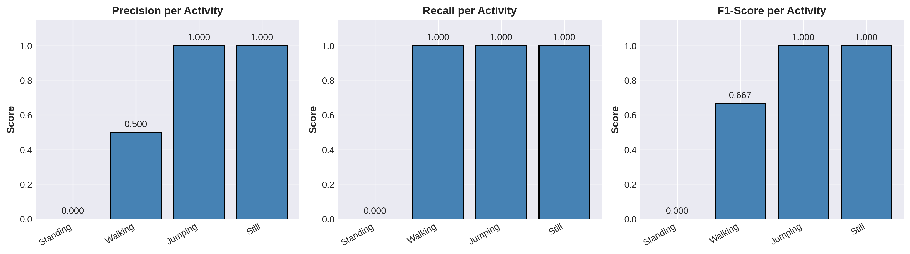
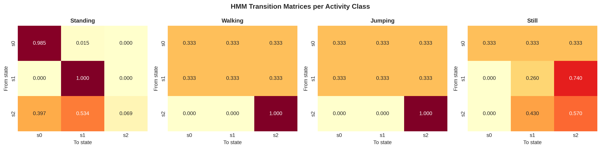
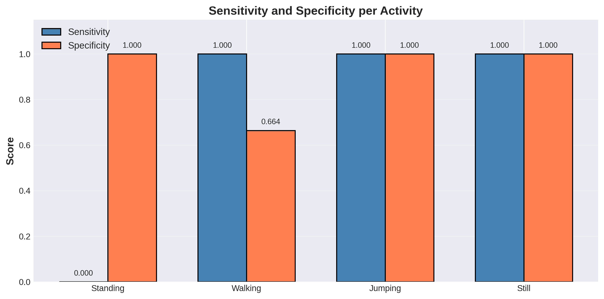
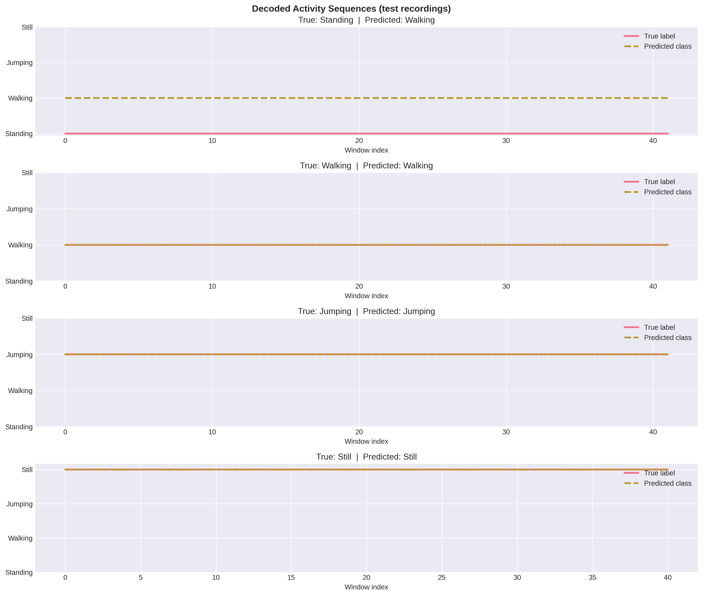

# Human Activity State Classification

## Overview

This project implements a Hidden Markov Model (HMM) to automatically classify and predict human activity states from sensor data collected via smartphone accelerometer and gyroscope readings. The system can recognize and distinguish between different physical activities including standing, walking, jumping, and remaining still.

## Project Context

Activity recognition from wearable sensors is a fundamental capability with applications in health monitoring, fitness tracking, and smart home systems. This project addresses the challenge of building robust models that can infer real-world human activity states from continuous sensor streams, where the underlying activity may not be directly observable.

## Project Structure

```
Human-Activities-State/
├── README.md
├── notebooks/
│   └── activity_recognition_hmm.ipynb
├── data/
│   ├── jumping/
│   │   └── Jumping_[1-5].csv
│   ├── standing_waist/
│   │   └── standing_waist_[1-8].csv
│   ├── still/
│   │   └── still_[1-5].csv
│   └── walking/
│       └── walking_[1-5].csv
└── results/
    ├── confusion_matrix.png
    ├── per_activity_metrics.png
    ├── hmm_transition_matrices.png
    ├── sensitivity_specificity.png
    └── decoded_activity_sequences.png
```

## Dataset Description

The dataset contains sensor readings collected from smartphone accelerometer and gyroscope sensors during four distinct human activities:

- **Standing** (8 samples): Stationary position at waist level
- **Walking** (5 samples): Continuous walking motion at consistent pace
- **Jumping** (5 samples): Repeated jumping motion
- **Still** (5 samples): Stationary position on flat surface

Each data file contains:
- Accelerometer readings (X, Y, Z axes)
- Gyroscope readings (X, Y, Z axes)
- Timestamp information
- Sampling rate metadata

## Methodology

### 1. Feature Extraction
Extract both time-domain and frequency-domain features from sensor windows:

**Time-Domain Features:**
- Mean and variance of accelerometer/gyroscope signals
- Standard deviation
- Signal magnitude area
- Cross-axis correlation

**Frequency-Domain Features:**
- Dominant frequency components
- Spectral energy
- FFT-based representations

### 2. Model Architecture

The Hidden Markov Model consists of:
- **Hidden States (Z):** The four activity types (standing, walking, jumping, still)
- **Observations (X):** Feature vectors extracted from sensor data
- **Transition Probabilities (A):** Likelihood of transitioning between activities
- **Emission Probabilities (B):** Probability of observing feature patterns given an activity
- **Initial State Probabilities (π):** Starting likelihood for each activity

### 3. Model Training
Train the HMM using the Baum-Welch algorithm to optimize:
- State transition probabilities
- Emission probability distributions
- Initial state probabilities

### 4. Inference
Apply the Viterbi algorithm to decode the most likely sequence of activities from observed sensor data.

## Getting Started

### Prerequisites
- Python 3.8+
- NumPy
- SciPy
- pandas
- matplotlib
- Scikit-learn or hmmlearn

### Installation

```bash
pip install numpy scipy pandas matplotlib scikit-learn hmmlearn
```

### Basic Usage

```python
# Load and preprocess data
# Extract features from sensor windows
# Train HMM model
# Evaluate on test data
# Decode activity sequences
```

## Key Files (To Be Generated)

- `feature_extraction.py` - Signal processing and feature computation
- `hmm_model.py` - HMM implementation and training
- `evaluation.py` - Model performance metrics and validation
- `analysis.ipynb` - Jupyter notebook with complete analysis and visualizations

## Evaluation Metrics

Model performance will be evaluated using:
- Overall accuracy across all activities
- Per-activity sensitivity (true positive rate)
- Per-activity specificity (true negative rate)
- Confusion matrix
- Transition probability analysis

## Model Results

### Performance Summary

Classification accuracy achieved on test data:
- **Overall Accuracy:** 74.85%
- **Activities Recognized:** Standing, Walking, Jumping, Still
- **Perfectly Classified:** Jumping and Still (100% accuracy)
- **Challenge:** Standing activity shows lower recognition

### Key Visualizations

The analysis includes comprehensive visualizations saved in the `results/` folder:

#### 1. **Confusion Matrix** (`confusion_matrix.png`)
Shows the classification performance for each activity. Diagonal values represent correct predictions, while off-diagonal values show misclassifications.



#### 2. **Per-Activity Metrics** (`per_activity_metrics.png`)
Displays precision, recall, and F1-score for each activity, allowing detailed performance assessment.



#### 3. **HMM Transition Matrices** (`hmm_transition_matrices.png`)
Visualizes the learned state transition probabilities for each activity class. Darker colors represent higher transition probabilities, revealing the temporal patterns learned by each activity-specific HMM.



#### 4. **Sensitivity and Specificity** (`sensitivity_specificity.png`)
Compares the true positive rate (sensitivity) and true negative rate (specificity) for each activity. Critical for understanding detection capability and false alarm rates.



#### 5. **Decoded Activity Sequences** (`decoded_activity_sequences.png`)
Shows example test recordings with true labels (solid lines) versus predicted labels (dashed lines), visually demonstrating model predictions on actual sensor data.



## Analysis Points

- **Activity Distinguishability:** Walking, Jumping, and Still are well-distinguished; Standing and Walking show some overlap
- **Behavioral Patterns:** HMM transition matrices reveal activity-specific temporal dynamics
- **Sensor Characteristics:** Different activities exhibit distinct frequency domain patterns
- **Model Strengths:** Perfect recognition of dynamic activities (Jumping) and static activities (Still)

## Submission Contents

The final submission includes:
1. Cleaned and labeled CSV dataset files
2. Feature extraction and model implementation
3. Complete Jupyter notebook with analysis
4. Professional report (4-5 pages) covering:
   - Project background and motivation
   - Data collection methodology
   - Feature engineering approach
   - Model design and training details
   - Results and performance metrics
   - Discussion and recommendations

## References

- Additional documentation on Hidden Markov Models
- Sensor data processing best practices
- Activity recognition benchmarks

---

*Last Updated: March 2026*
